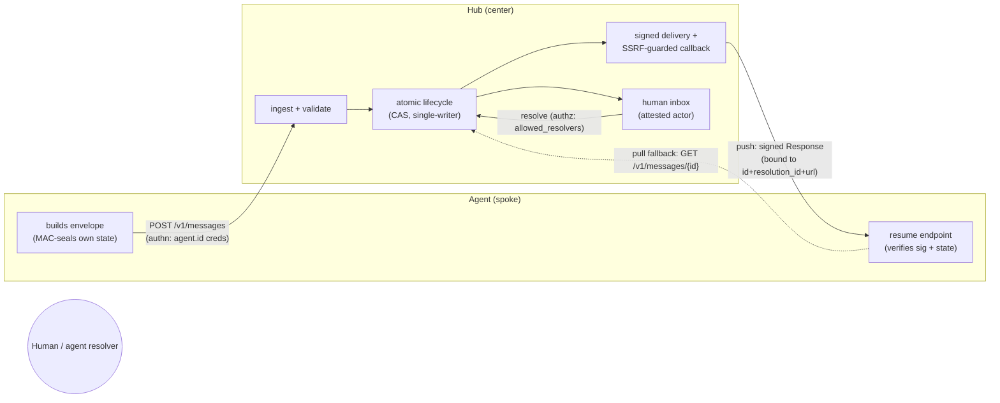
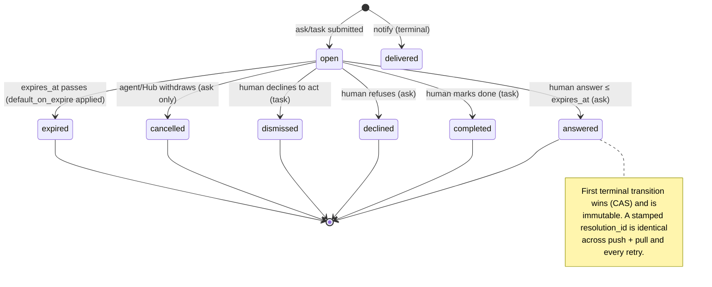

# feat: A2H Protocol v0.2 — full hardening pass

## Summary

Rewrite the A2H (Agent-to-Human) protocol from v0.1 (draft) to v0.2 by resolving every P0/P1 and the well-corroborated P2s surfaced by a seven-persona design review. The review found the **agent→Hub request path and the `notify` verb are largely sound**, but the **Hub→agent return leg and the `ask`/`task` trust + concurrency model are ~40% specified — and it's the security-critical 40%**. This plan is a **spec + schemas + examples rewrite only**. No application code: the reference Hub ("OH HAI") and the daily-digest app are explicitly **downstream** of this plan.

The work is grouped into five phases that build outward from the sound foundation: (A) envelope + terminology + versioning, (B) the missing return leg + verb completeness, (C) the trust model + concurrency, (D) reliability + protocol surface, (E) agent-native narrative + examples + conformance vectors.

---

## Problem Frame

A2H v0.1 was a fast first draft that nailed the *shape* of the protocol (three verbs — `notify`/`ask`/`task` — hub-and-spoke, push/pull decision callbacks) but left the hard half unspecified. The review clustered ~30 findings into **four root causes**:

1. **The return leg is half-built.** No JSON Schema for the Response envelope; an incoherent `resolution` enum (`ignored` unreachable, `dismissed` missing from §6, four sections disagree); no body integrity; `state` is referenced in the Response but absent from the request envelope and schema, so the round-trip is a broken loop; "state"/"status"/"resolution" are overloaded; no error model.
2. **The trust model is missing.** Opaque `state` round-trips with zero integrity and the agent is never told to distrust it (resume-hijack → code-exec); `response.actor` is unauthenticated with no authorization on who may resolve; `callback.url` is an unconstrained agent-supplied URL the Hub fetches *with an attached credential* (SSRF / confused-deputy — the worked GitHub-PAT example is itself the anti-pattern); body integrity exists only for `scheme=hmac` while the only example uses `bearer`; the replay window has no nonce.
3. **No concurrency model.** Every lifecycle transition is an unguarded race (expiry-vs-answer, concurrent resolve, push+pull double-delivery → the agent acts twice).
4. **Durability/abuse limits unspecified.** A push-only agent permanently loses its resolution after retry exhaustion; no Hub durability requirement; no rate/quota/size caps (inbox denial-of-attention + a mandated-retry callback amplifier).

The cost of *not* fixing these before any implementation: early adopters build against ambiguous prose, diverge incompatibly, and ship the insecure interpretations — exactly what kills protocol adoption (an implementer's legal/security review blocks a spec they can't pin down). Hence: full hardening first, code second.

---

## Requirements

Each requirement traces to one or more review findings (P-tags). Implementation Units cite these R-IDs.

**Return leg (root cause 1)**
- **R1** — The Response envelope has a normative JSON Schema; the Hub→agent half is validatable. *(P0 #1)*
- **R2** — One canonical resolution model, discriminated by verb, consistent across every section and the schema. *(P0 #2)*
- **R3** — `state` is a first-class request-envelope field + schema property; the round-trip loop is closed. *(P0 #7)*
- **R16** — A canonical error model: error envelope, HTTP status table (401/403/404/409/410/422/429), and 4xx-no-retry / 5xx-retry callback semantics. *(P1 #16)*
- **R17** — Terminology disambiguation: `state` (opaque blob) vs lifecycle `status` vs `resolution` (terminal outcome). *(P1 #17)*

**Trust model (root cause 2)**
- **R4** — Opaque `state` is integrity-protected by the *agent*; the spec mandates treating returned `state` as untrusted until verified. *(P0 #3)*
- **R5** — `actor` is Hub-attested from an authenticated operator session, never request-supplied; per-message resolver authorization. *(P0 #4)*
- **R6** — Callback destinations are SSRF-safe: per-agent host allowlist, blocked private/link-local/metadata ranges, no redirects, credential attached only when the host matches a registered binding. *(P0 #5)*
- **R7** — Response body integrity for **all** callback schemes (detached signature over a canonical Response), plus nonce/jti + receiver replay cache, signature bound to message id + callback URL, Hub-clock authority, tightened window. *(P0 #6)*
- **R12** — `sensitive` field handling and the secret-reference (CHEQ) shape are expressible in the schema; telemetry minimization is the default. *(P1 #12)*
- **R13** — Per-scheme callback auth: `secret_ref` (hmac) / `token_ref` (bearer, apikey), with transmission defined. *(P1 #13)*
- **R22** — Markdown `body` sanitization + `context.file.uri` SSRF controls for the inbox surface. *(P2)*

**Concurrency (root cause 3)**
- **R9** — Atomic single-writer lifecycle: all transitions are compare-and-set; first terminal transition wins and is immutable; defined precedence for expiry-vs-answer and resolve-vs-cancel. *(P1 #9)*
- **R10** — At-most-once action: a Hub-assigned `resolution_id` is identical across every channel/retry; agents MUST dedup on `(in_reply_to, resolution_id)` and act once. *(P1 #10)*

**Reliability & surface (root cause 4)**
- **R8** — No resolution is lost: after push-retry exhaustion the resolution MUST remain pull-available (DLQ) with a minimum retention TTL; 410 Gone vs 404. *(P0 #8)*
- **R18** — Abuse limits: per-agent submit-rate + inbox-depth caps (429 + `Retry-After`), max envelope/Part size, callback total-attempt + duration caps. *(P1 #18)*
- **R19** — Hub durability of open messages and in-flight retry state is a conformance MUST. *(P1 #19)*
- **R24** — `idempotency_key` scope is defined precisely (per `agent.id`, run-independent, with a TTL). *(P2, flagged by all five applicable reviewers)*

**Foundation & agent-native**
- **R14** — Version scheme accepts any `0.x`, defines MAJOR.MINOR parsing, unknown-major → 400, ignore-unknown-fields robustness. *(P1 #14)*
- **R15** — A single id-assignment model. *(P1 #15)*
- **R11** — A normative "ephemeral agent resume pattern" (exit→reinvoke→reconstruct) with a two-process timeline. *(P1 #11)*
- **R20** — Schema forbids cross-type field leakage (discriminated `oneOf` on `type`); `mode=confirm`, `default_on_expire`, and task-expiry are fully specified. *(P2 cluster)*
- **R21** — A discovery/capability endpoint (`GET /.well-known/a2h`). *(P2)*
- **R23** — A starter conformance test-vector set. *(testing gap, multiple reviewers)*

**Hardening gaps surfaced by the plan doc-review (2026-06-03)**
- **R25** — Normative signature canonicalization (RFC 8785) + a worked signature test vector; without it R7 is undeliverable. *(doc-review: feasibility/security P0)*
- **R26** — Normative state-seal key provenance (per-agent, Hub-invisible, survives re-invocation, never in `state`). *(doc-review: security P0)*
- **R27** — `notify` durability: a `delivered` notify MUST survive a Hub restart and be pull-checkable; the daily digest is the named conformance witness. *(doc-review: adversarial P0)*

---

## Key Technical Decisions

These settle the design forks. Each is a recommended direction with the alternative noted; review and redirect any before execution.

- **KTD1 — id assignment: Hub-canonical, with two distinct correlation fields.** The Hub mints the canonical `id` (returned in the 202 ack), globally unique within the Hub. Two *separate* agent-supplied fields exist and MUST NOT be conflated: `client_ref` is an optional, opaque, human-readable correlation **label** (never used for dedup; access-controlled so it is not exposed to resolvers); `idempotency_key` is the **dedup key** (see KTD-idemp below). *Resolves R15. Alt: agent-supplied-with-global-uniqueness — rejected; pushes a distributed-uniqueness burden onto every ephemeral agent and creates the agent-id-vs-Hub-id ambiguity the review flagged.*
- **KTD1b — `idempotency_key` is REQUIRED for `ask`/`task`.** Because Hub-canonical ids (KTD1) leave an ephemeral agent with no id until the 202, a lost 202 forces a blind retry; the only thing preventing a duplicate human decision is the idempotency key. It is therefore REQUIRED on `ask`/`task` submissions (MAY on `notify`), scoped to `(agent.id, idempotency_key)`, run-independent, with a TTL; a replay with a differing payload → 409, an identical replay returns the stored current status. The agent retry recipe (retry with the same key until a 202 or 409) is normative in the ephemeral-resume section. `resolution_id` MUST be a Hub-generated opaque random value (not a counter/timestamp). *Resolves R24, and the lost-202 duplicate-decision risk.*
- **KTD2 — Response leg is A2H-owned, borrowing A2A conventions, not depending on A2A.** We define our own `response.schema.json` and reuse A2A's *shapes* (Part union, `PushNotificationConfig`-style auth) as conventions. *Resolves R1. Alt: import A2A Message/Task types directly — rejected; couples A2H's evolution to A2A's and the human-inbox semantics don't map cleanly onto A2A's agent-to-agent task model.*
- **KTD3 — `state` integrity is the agent's responsibility.** The Hub stores/returns `state` opaquely and MUST NOT inspect or log it (necessary but insufficient). The spec REQUIRES the agent to treat returned `state` as untrusted and verify integrity it applied itself before use; it RECOMMENDS AEAD (encrypt-then-MAC) with a key the Hub never sees, and permits a minimal HMAC for low-sensitivity state. *Resolves R4. Alt: Hub-guaranteed integrity — rejected; defeats opacity and makes a compromised Hub a code-exec vector.*
- **KTD4 — `actor` is Hub-attested; resolver authz defaults fail-closed.** `actor` is derived from the Hub's authenticated operator session, never from the resolving request body; format `<type>:<id>` with `type ∈ {human, agent, system}`. Messages carry an optional `allowed_resolvers` policy; **when absent, the default is fail-closed** — only the submitting `agent.id`'s own identity may resolve, and an agent widens explicitly. (A fail-open default would ship the unauthenticated-resolver P0 as opt-in.) Expiry-defaulted responses MUST carry `actor: "system:default_on_expire"` + `defaulted: true`. *Resolves R5. Alt: request-supplied actor with a signature — rejected; still forgeable by anyone holding the signing key and conflates authn with transport.*
- **KTD5 — Body integrity for all callback schemes.** The Hub MUST send a detached signature over the canonical Response for every scheme (hmac/bearer/apikey), bound to `id` + `resolution_id` + callback URL, with a `jti` nonce and a receiver replay cache; window tightened to ±120s against the **Hub** clock. *Resolves R7. Alt: keep signing hmac-only — rejected; the only worked example (bearer) would have zero body authenticity → forgeable "ship to prod."*
- **KTD6 — SSRF: pre-registered, verified callback hosts.** A `callback.url` host MUST be pre-registered and ownership-verified per `agent.id` before first use; private/link-local/metadata ranges are refused; no redirect following; the referenced credential is attached only when the URL host matches a registered binding. The GitHub-PAT-to-`/dispatches` example is replaced with an agent-owned resume endpoint and an explicitly-labeled anti-pattern note. *Resolves R6, R22. Alt: blocklist-only — weaker; rebinding/DNS tricks bypass it.*
- **KTD7 — Concurrency: atomic CAS, first-terminal-wins, `resolution_id` dedup.** All lifecycle transitions are a single atomic compare-and-set; the first transition to a terminal state wins and is immutable; a human answer received at/before `expires_at` beats `default_on_expire`; on terminal transition the Hub cancels in-flight push retries; `resolution_id` is identical on every channel and retry; agents MUST act at most once per `(in_reply_to, resolution_id)`. *Resolves R9, R10. Alt: advisory "pull is source of truth" prose — rejected as non-operational (the review's root finding).*
- **KTD8 — Delivery: DLQ + guaranteed pull availability.** After push-retry exhaustion the resolution MUST remain available via pull for a minimum retention TTL (default 30 days); a deleted message returns 410, an unknown id returns 404. *Resolves R8.*
- **KTD9 — Hub durability is a conformance MUST.** Open messages, committed resolutions, and retry counters MUST survive a Hub restart; in-memory-only storage is non-conformant. *Resolves R19. Alt: SHOULD — rejected; an in-memory Hub silently drops open asks while passing every other MUST.*
- **KTD10 — Versioning: pattern-accept `0.x` + robustness.** `a2h_version` matches `^0\.\d+$` in the schema; the spec defines MAJOR.MINOR parsing, unknown-major → 400, and ignore-unknown-fields. *Resolves R14.*
- **KTD11 — Discovery via `GET /.well-known/a2h`.** A capability document advertises max body/Part size, supported auth + callback schemes, rate limits, and retention TTL. *Resolves R21. Mirrors A2A's Agent Card.*
- **KTD12 — Schema strategy: discriminated `oneOf` on `type`.** Each verb branch enumerates exactly its allowed fields (no cross-type leakage); per-scheme `if/then` conditionals bind `secret_ref`↔hmac and `token_ref`↔{bearer,apikey}; a property-level `x-a2h-sensitive: true` annotation expresses the privacy flag. *Resolves R20, R12, R13.*
- **KTD13 — Signature canonicalization is normative (RFC 8785 JCS).** The detached Response signature (KTD5) signs a defined `signed_context` object — `{id, resolution_id, callback_url, resolution, resolved_at}` — serialized with **RFC 8785 JSON Canonicalization Scheme** (deterministic key ordering, number/Unicode normalization), then HMAC-SHA256 (hmac) or Ed25519 (optional, for asymmetric). Transmitted as `A2H-Signature: t=<unix>,jti=<nonce>,v1=<base64url(sig)>`. The receiver replay cache keys on `jti` and MUST retain entries for at least the validity window (the cache TTL is a separate, stated value ≥ window; it is *not* the 30-day message retention). A worked test vector (known input → known signature bytes) ships in `conformance/vectors/`. *Resolves R7 properly (was undeliverable without a canonical form). Alt: per-Hub serialization — rejected; produces mutually-unverifiable signatures.*
- **KTD14 — State-seal key provenance: per-agent operator secret, Hub-invisible.** The key the agent uses to AEAD-seal `state` (KTD3) MUST be a per-`agent.id` secret **pre-positioned in the agent runtime** (e.g., a CI/Actions secret, a vault env var), **distinct from the callback credential**, that survives re-invocation independently of any Hub-held value. The key MUST NOT be embedded in `state` (circular — zero integrity) and MUST NOT transit the Hub. The spec ships a negative example of the embedded-key anti-pattern. Note: if this key co-resides with a compromised callback host, the guarantee is void — stated explicitly. *Closes the resume-hijack P0 in practice, not just on paper. Alt: leave key provenance to implementers — rejected; the naive choice (key-in-state) is the exact failure the control exists to prevent.*

---

## High-Level Technical Design

### Two-leg architecture and trust boundaries



Trust boundaries: the **request leg** is authenticated by per-`agent.id` credentials; the **return leg** is integrity-protected by a detached signature the agent verifies; **`state`** is opaque to the Hub and integrity-sealed by the agent (the Hub is never trusted with state integrity).

### Unified lifecycle (atomic, single-writer)



### Ephemeral agent resume pattern (the make-or-break flow)

```mermaid
sequenceDiagram
  participant R1 as Agent run #1 (exits)
  participant Hub
  participant H as Human
  participant R2 as Agent run #2 (re-invoked)
  R1->>R1: seal state (encrypt-then-MAC)
  R1->>Hub: POST ask {state, callback.url = re-invoke trigger}
  Hub-->>R1: 202 {id, poll_url}
  Note over R1: run #1 exits — nothing held open
  H->>Hub: resolve (attested actor, authz checked)
  Hub->>Hub: atomic terminal transition, stamp resolution_id
  Hub->>R2: signed Response {resolution, resolution_id, state}
  R2->>R2: verify sig + replay cache; verify+open state MAC
  R2->>R2: dedup (in_reply_to, resolution_id); act once
```

---

## Output Structure

```
a2h-protocol/
├── spec/
│   ├── v0.1.md                      # retained, marked superseded
│   └── v0.2.md                      # NEW — the rewrite
├── schema/
│   └── v0.2/
│       ├── message.schema.json      # NEW — request leg, discriminated oneOf
│       ├── response.schema.json     # NEW — the return leg
│       ├── submit-ack.schema.json   # NEW — 202 body
│       ├── get-message.schema.json  # NEW — GET /v1/messages/{id} body
│       └── capability.schema.json   # NEW — /.well-known/a2h doc
├── examples/                        # expanded (see U10)
├── conformance/
│   ├── README.md                    # NEW — vector format + how to run
│   └── vectors/                     # NEW — starter conformance vectors
├── CHANGELOG.md                     # NEW — v0.1 → v0.2 migration notes
├── README.md                        # updated (fix false schema claim, bump version)
└── GOVERNANCE.md                    # version refs updated
```

Per-unit `**Files:**` lists remain authoritative; this tree is the scope declaration.

---

## Implementation Units

### Phase A — Foundation

### U1. Envelope, terminology, id model, and versioning

- **Goal:** Lock the common message envelope, disambiguate the overloaded vocabulary, settle the Hub-canonical id model, add `state` as a first-class field, and fix the version scheme.
- **Requirements:** R3, R14, R15, R17, R20 (envelope discriminator).
- **Dependencies:** none.
- **Files:** `spec/v0.2.md` (§1 Terminology, §4 Envelope, §10 Versioning), `schema/v0.2/message.schema.json` (envelope core + discriminated `oneOf` skeleton).
- **Approach:** Reserve `state` for the opaque agent blob only; rename the lifecycle concept to **`status`** everywhere (the §7 phase and the wire field) and **`resolution`** for terminal outcomes (KTD per R17). Add `state` (object, MAY) to §4 + schema with "Hub MUST NOT inspect or log." Hub-canonical id (KTD1): `id` is Hub-assigned and returned in the 202. Add the two distinct correlation fields to the §4 envelope + schema here: `client_ref` (optional opaque label) and `idempotency_key` (the dedup key — REQUIRED for `ask`/`task` via the `oneOf` branch, MAY for `notify`, per KTD1b); U7 owns its *scope semantics* (409 etc.) in prose. Version: `a2h_version` schema pattern `^0\.\d+$` + §10 MAJOR.MINOR parse rule, unknown-major→400, ignore-unknown-fields (KTD10). Establish the `oneOf`-on-`type` skeleton so later units attach verb-specific blocks without cross-type leakage.
- **Patterns to follow:** A2A `contextId`/`Part` naming; the existing v0.1 §4 table as the starting structure.
- **Conformance scenarios (spec/schema validation):**
  - A `notify` envelope carrying a `request` or `action` block is **rejected** by the schema.
  - A message with `a2h_version: "0.2"` and an unknown extra field **validates** (robustness).
  - A message with `a2h_version: "1.0"` is flagged unknown-major (spec rule; schema pattern rejects).
  - `state` is accepted on the request envelope and documented as opaque.
  - Every occurrence of "state" in the prose is audited: lifecycle uses `status`, outcome uses `resolution`, only the blob uses `state`.
- **Verification:** The envelope section + schema skeleton round-trip the three verbs with no shared mutable field; a grep for "state" finds only blob usages.

### U2. `notify` verb + transport ack/GET, with schemas

- **Goal:** Pin the clean `notify` path end-to-end and the submit/poll transport bodies — the only surface the downstream digest depends on.
- **Requirements:** R1 (ack/GET schemas), R17 (status enum).
- **Dependencies:** U1. (Note: `get-message.schema.json`'s `response` field is stubbed as `object` here and `$ref`'d to `response.schema.json` after U3 lands — flagged so the implementer doesn't hit the forward-reference mid-unit.)
- **Files:** `spec/v0.2.md` (§5.1 notify, §8.1 submit, §8.2 GET), `schema/v0.2/submit-ack.schema.json`, `schema/v0.2/get-message.schema.json`, `examples/notify-daily-digest.json` (revalidate).
- **Approach:** `notify` is `delivered` on acceptance (terminal; the 202 ack carries `status: delivered` — there is no observable `created` state, and no undeliverable state machine in v0.2). **But fire-and-forget ≠ droppable (R27):** a `delivered` notify MUST be durable — it MUST survive a Hub restart and remain pull-checkable via `GET /v1/messages/{id}` for the retention TTL, so a digest agent can confirm it landed. The daily digest is the named conformance witness for notify durability. Enumerate the full `status` value space and give the 202 ack + GET body their own schemas. Define long-poll `?wait` as a server-max, returning current status on timeout (not an error).
- **Conformance scenarios:**
  - `examples/notify-daily-digest.json` validates against `message.schema.json`.
  - A 202 ack body validates against `submit-ack.schema.json` (`id`, `status`, `poll_url`, `review_url`).
  - A GET body for an open ask validates against `get-message.schema.json`; for a terminal ask it includes the embedded Response.
  - The Hub MUST NOT route a response for a `notify` (assertion documented).
- **Verification:** The digest example is a conformant `notify`; transport bodies are schematized.

### Phase B — Return leg & verb completeness

### U3. Response envelope + canonical resolution model

- **Goal:** Define the Hub→agent Response as a first-class schema and settle the resolution enum once.
- **Requirements:** R1, R2, R10 (introduce `resolution_id`).
- **Dependencies:** U1, U2.
- **Files:** `spec/v0.2.md` (§6 Response, §7 lifecycle reconciliation), `schema/v0.2/response.schema.json`, `examples/response.json` (rewrite).
- **Approach:** Canonical, verb-discriminated `resolution`: ask → `{answered, declined, cancelled, expired}`; task → `{completed, dismissed, expired}`. Note `cancelled` is **ask-only** (task has no cancel terminal in v0.2) — annotate the schema enum and the lifecycle diagram so the verb-unqualified arrow isn't read as task-cancellable. The v0.1 `allow_ignore` permission field is **removed**; a human ignoring an ask is represented as `declined` with `response.actor` reflecting the ignore (no orphan `ignored` value), so `ignored` is not in the enum. Reconcile §1/§6/§7/§11 to this single list. `response.value` is a discriminated union keyed on the echoed request `mode`. Define a `responseAgent` shape (`id` + `run_id` only — `runtime` not required on the return leg). Introduce Hub-assigned `resolution_id` here — it MUST be an opaque random value (UUIDv4-class entropy), never a counter/timestamp. Response presence rules: required for `ask`; for `task` present only as a human comment/checklist-final-state (no `value`); never for `notify`.
- **Patterns to follow:** A2A Message/Part as conventions (KTD2), not imports.
- **Conformance scenarios:**
  - `examples/response.json` validates against `response.schema.json`.
  - A response with `resolution: "ignored"` is **rejected** (no longer in the enum).
  - A `task` response carrying `response.value` is **rejected**; a `task` response with only `comment` validates.
  - The §6/§7/§1/§11 resolution lists are byte-identical to the schema enum (cross-ref audit).
  - The `response.json` `agent` block (id+run_id, no runtime) validates against `responseAgent`.
- **Verification:** An implementer can codegen a response deserializer from the schema and parse every example.

### U4. `ask` + `task` request blocks hardened + schema completeness

- **Goal:** Fully specify the `ask`/`task` request blocks and close the schema gaps.
- **Requirements:** R12 (sensitive), R20 (confirm, default_on_expire, task expiry), R13 (auth fields land here structurally; semantics in U5).
- **Dependencies:** U1, U3.
- **Files:** `spec/v0.2.md` (§5.2 ask, §5.3 task), `schema/v0.2/message.schema.json` (request/action defs), `examples/` (add `ask-mode-input.json`, `ask-mode-confirm.json`, `ask-sensitive-field.json`).
- **Approach:** `permissions` → state mapping table (which flag gates which transition/affordance). `mode=confirm`: Hub synthesizes canonical `approve`/`deny` options when `options` absent; `response.value ∈ {approve, deny}`. `default_on_expire` constrained to a member of `options[].value` for `select`, and a defined object shape (validating against `schema`) or `null` for `input`. Task expiry: `task` resolves `expired` with no default applied (stated; no `action.default_on_expire`). `sensitive`: property-level `x-a2h-sensitive: true` in the input `schema`, plus a message-level flag (KTD12).
- **Conformance scenarios:**
  - `ask-mode-confirm.json` with no `options` validates; spec asserts Hub-synthesized approve/deny.
  - `default_on_expire` not present in `options[].value` is **rejected** (or flagged per the cross-field rule).
  - `ask-mode-input.json` exercises the object-shaped `response.value` branch.
  - `ask-sensitive-field.json` carries `x-a2h-sensitive: true`; spec asserts exclusion from telemetry/export.
  - A `task` with `action.default_on_expire` is **rejected** (field does not exist).
- **Verification:** Every `mode` and both verbs have a validating worked example; no schema-vs-prose gaps remain for the request leg.

### Phase C — Trust & concurrency

### U5. Trust & security model

- **Goal:** Specify the whole trust layer: state integrity, actor attestation + authz, callback body integrity, SSRF controls, secret/token refs, sanitization, telemetry minimization.
- **Requirements:** R4, R5, R6, R7, R12, R13, R22.
- **Dependencies:** U3, U4.
- **Files:** `spec/v0.2.md` (§9 Security & Privacy — major expansion; §6 actor; §8.3 callback auth), `schema/v0.2/message.schema.json` (auth per-scheme `if/then`, `allowed_resolvers`), `schema/v0.2/response.schema.json` (`actor` pattern, `defaulted`).
- **Approach:** State integrity (KTD3 + **KTD14**): normative "returned `state` is UNTRUSTED; agent MUST verify integrity it applied before use," RECOMMEND AEAD, with the key-provenance rules from KTD14 (per-agent, Hub-invisible, never in `state`) and the embedded-key anti-pattern example. Actor (KTD4): Hub-attested `<type>:<id>`, `allowed_resolvers` authz **defaulting fail-closed**, `system:default_on_expire` + `defaulted:true` for expiry. Callback integrity (KTD5 + **KTD13**): detached signature over the **RFC 8785-canonicalized `signed_context`** for **all** schemes, `jti` nonce + receiver replay cache (TTL ≥ window, stated), ±120s Hub-clock window, `A2H-Signature` header format, + a worked signature vector. SSRF (KTD6) — restate as **observable conformance**: a Hub MUST verify callback-host ownership before attaching a referenced credential (method implementation-defined: DNS-TXT / HTTP well-known / operator approval), MUST apply the private/link-local/metadata-range refusal **at delivery time** (not just registration — DNS-rebinding defense), and MUST NOT follow redirects. Per-scheme auth (KTD12): `secret_ref`↔hmac, `token_ref`↔{bearer,apikey}, transmission defined (Authorization: Bearer / X-Api-Key); state whether the body-signing key is the same as or distinct from the callback-auth credential, and that rotation is supported (two valid keys during overlap). Inbox safety (R22) — observable MUSTs: a Hub MUST NOT render raw HTML from `body` in the inbox, and MUST NOT server-side-fetch `context.file.uri` unless it passes the callback host-verification controls. Telemetry: Hub logs SHOULD exclude `body`/`context`/`response.value`/`response.comment` by default and MUST NOT log `state` (KTD3); `x-a2h-sensitive` strengthens the SHOULDs to MUST and applies to the whole envelope. Replace the GitHub-PAT example with a safe agent-owned resume endpoint + an annotated anti-pattern callout.
- **Conformance scenarios:**
  - Schema rejects `scheme: hmac` without `secret_ref`, and `scheme: bearer` with `secret_ref` but no `token_ref`.
  - `actor` not matching `^(human|agent|system):.+$` is **rejected**.
  - A message with `allowed_resolvers` validates; spec asserts the Hub enforces it.
  - Spec text contains a "returned state is untrusted" MUST and an SSRF allowlist MUST (presence audit).
  - The anti-pattern example is labeled and the canonical callback example points at an agent-owned host.
- **Verification:** A security reviewer can trace each P0 (#3,#4,#5,#6) to a normative control; no callback path attaches a credential to an unverified host.

### U6. Concurrency & lifecycle integrity

- **Goal:** One atomic-transition rule and every race resolved deterministically.
- **Requirements:** R9, R10.
- **Dependencies:** U3, U5.
- **Files:** `spec/v0.2.md` (§7 lifecycle, §8.3 push, §8.4 cancel).
- **Approach:** Normative: all transitions are an atomic compare-and-set; first terminal transition wins, immutable. Expiry vs answer: a human answer received at/before `expires_at` beats `default_on_expire`. Resolve vs cancel (ask-only `cancelled`): first terminal wins; cancel-after-terminal is a no-op returning the existing Response (not a fake success); `cancelled` still emits a Response so push/pull agents get closure. **Stated as an observable guarantee, not a mechanism:** once a message is terminal, the Hub MUST NOT deliver a *different* resolution — in-flight attempts for the terminal resolution MAY complete (same `resolution_id`; the agent dedups). `resolution_id` (from U3) is identical across channels/retries; agents MUST dedup on `(in_reply_to, resolution_id)` and act at most once. Operationalize "pull is source of truth": on push/pull disagreement the GET value is authoritative.
- **Conformance scenarios (described, since these are concurrency assertions):**
  - Defined outcome for: human answer at `t == expires_at` (answer wins).
  - Defined outcome for: cancel arriving after `answered` (no-op, returns answered Response).
  - Defined outcome for: push delivered then pull read (same `resolution_id`, agent acts once).
  - A second terminal transition attempt returns the first outcome unchanged.
- **Verification:** Each race named in the review (#9, #10) has a single normative resolution; a conformance vector (U10) encodes the expiry-vs-answer tie.

### Phase D — Reliability & protocol surface

### U7. Reliability & delivery durability

- **Goal:** Guarantee delivery survivability and Hub durability.
- **Requirements:** R8, R19, R24.
- **Dependencies:** U6.
- **Files:** `spec/v0.2.md` (§3.1 durability/conformance — new, §8.2 pull, §8.3 push).
- **Approach:** At-least-once + mandated receiver dedup (links to U6 `resolution_id`). Pull-available retention (KTD8) — stated observably, not as a queue mechanism: after push-retry exhaustion the resolution MUST remain available via `GET /v1/messages/{id}` for ≥ retention TTL (default 30 days); deleted → 410, unknown → 404; the mechanism is implementation-defined. Long-poll: agent MUST re-issue on drop; optional `?since` cursor; idempotent reads. Hub clock authoritative for `expires_at` + HMAC window. Durability (KTD9) — observable: a Hub restart MUST NOT lose any open message, committed resolution, **delivered notify (R27)**, or pending push-delivery obligation; a pending obligation MUST be re-attempted after restart while non-terminal. (State the guarantee, not "retry counters survive.") `idempotency_key` *scope semantics* (the field itself is added to the envelope in U1): `(agent.id, idempotency_key)`, run-independent, TTL; differing-payload replay → 409; identical replay returns the stored current status.
- **Conformance scenarios:**
  - Spec contains a durability MUST and a DLQ/retention MUST (presence audit).
  - `idempotency_key` replay with a changed body is specified to return 409 (vector).
  - GET on a deleted message returns 410, not 404 (vector).
- **Verification:** No path loses a committed resolution; idempotency scope is unambiguous.

### U8. Abuse limits, discovery, and error model

- **Goal:** Add the missing protocol surface: limits, discovery, errors.
- **Requirements:** R16, R18, R21.
- **Dependencies:** U2, U5, U6 (callback retry caps must align with U6's terminal-transition guarantee — caps apply to non-terminal messages; terminal state stops new deliveries regardless of remaining cap).
- **Files:** `spec/v0.2.md` (§8.0 discovery — new, §8.5 errors — new, §8.6 limits — new), `schema/v0.2/capability.schema.json`.
- **Approach:** Limits (KTD/R18): per-`agent.id` submit-rate + inbox-depth caps → 429 + `Retry-After`; max envelope + Part size; callback total-attempt + total-duration caps (closes the mandated-retry amplifier). Discovery (KTD11): `GET /.well-known/a2h` → capability doc (versions, max sizes, auth + callback schemes, rate limits, retention TTL), schematized. Error model (KTD/R16): canonical envelope `{ "error": { "code", "message" } }`; status table 401/403/404/409/410/422/429; callback retry semantics — 4xx no-retry, 5xx + network retry.
- **Conformance scenarios:**
  - A capability doc validates against `capability.schema.json`.
  - The error-code table maps each documented failure to one status (cross-ref audit).
  - Spec states callbacks retry on 5xx/network but not 4xx.
- **Verification:** An agent can discover a Hub's limits and parse its errors without out-of-band knowledge.

### Phase E — Agent-native, examples, conformance

### U9. Agent-native: ephemeral resume pattern + actor parity

- **Goal:** Make the exit→reinvoke→reconstruct flow normative and confirm agent-as-resolver parity.
- **Requirements:** R11, R5 (agent actor type).
- **Dependencies:** U1 (state), U3 (actor/resolution_id), U5 (state integrity).
- **Files:** `spec/v0.2.md` (§2.1 Ephemeral Agent Resume Pattern — new, with the two-process timeline; §6 actor `agent:` type).
- **Approach:** A normative section walking the five steps (seal state → submit with re-invoke callback → exit → Hub delivers signed Response with state → new process verifies + reconstructs + acts once), referencing the sequence diagram. Confirm the `actor` vocabulary supports `agent:<agent.id>` so an agent may resolve on behalf of its operator (autonomous-approval parity). State that the callback URL for an ephemeral agent is a *re-invoke trigger*, not just a data sink.
- **Conformance scenarios:**
  - The spec contains an explicit ephemeral-resume section (presence audit).
  - An `agent:`-typed `actor` validates against the §6 pattern.
- **Verification:** A reader implementing a GitHub-Action agent has an unambiguous resume recipe; the make-or-break flow is no longer implied.

### U10. Examples + conformance vectors

- **Goal:** Worked examples for every non-happy path + a starter conformance vector set.
- **Requirements:** R23 (plus example coverage for R2, R4, R5, R7, R9).
- **Dependencies:** U3–U9.
- **Files:** `examples/` (add: `response-expired-default.json`, `response-cancelled.json`, `response-declined.json`, `task-completion-response.json`, `callback-agent-resume.json` safe example + `callback-anti-pattern.md` annotation). The `ask-mode-input.json`, `ask-mode-confirm.json`, and `ask-sensitive-field.json` files are created by U4 and consumed here as inputs (not re-created — avoids the U4/U10 ownership collision). `conformance/README.md`, `conformance/vectors/`.
- **Approach:** Define a vector format: `{ description, input (envelope), expect (validates|rejects, against which schema, or the expected transition outcome) }`. Cover the previously-untested surfaces: every resolution value, the expiry-vs-answer tie, the cross-type rejection, the per-scheme auth rejections, idempotency replay (409), GET-deleted (410).
- **Conformance scenarios:**
  - Every example file validates against its schema (or is an intentional negative vector marked `rejects`).
  - The vector set includes ≥1 case per P0 finding.
- **Verification:** A second implementer can run the vectors and prove conformance without reading prose.

### U11. README / GOVERNANCE / CHANGELOG finalization

- **Goal:** Fix the false "messages + responses" claim, bump version refs, mark v0.1 superseded, document the migration.
- **Requirements:** (doc integrity; supports all).
- **Dependencies:** U1–U10.
- **Files:** `README.md`, `GOVERNANCE.md`, `CHANGELOG.md` (new), `spec/v0.1.md` (superseded banner), `spec/v0.2.md` (header).
- **Approach:** README repo-layout table lists `response.schema.json` + the new schemas separately; correct the schema-coverage sentence; bump all `0.1`→`0.2` references; add a `CHANGELOG.md` summarizing the four root-cause fixes and v0.1→v0.2 breaking changes (id model, resolution enum, mandatory state integrity); add a "superseded by v0.2" banner to `spec/v0.1.md`.
- **Conformance scenarios:**
  - No file claims the schema covers responses unless `response.schema.json` exists.
  - All version strings are consistent (grep audit).
- **Verification:** A newcomer reading the README gets an accurate map; v0.1 is clearly archival.

---

## Scope Boundaries

**In scope:** the v0.2 spec rewrite, the five new/updated JSON Schemas, the expanded examples, the starter conformance vectors, and the doc updates (README/GOVERNANCE/CHANGELOG).

### Deferred to Follow-Up Work (downstream of this plan)
- **OH HAI reference Hub** — the hosted server + native triage app that *implements* A2H. The reference implementation is the next major workstream after this spec lands.
- **The daily-digest app** — the on-device RN app + local server behind a Cloudflare tunnel. It consumes the `notify` path (U2) but is built against the reference Hub, not this plan.
- **A conformance test *runner*** — this plan defines vector *format* and a starter set; an executable harness that runs them is downstream.

### Deferred for later (intentional v0.2 non-goals)
- **Human identity / SSO mechanics.** v0.2 makes `actor` Hub-attested and requires the Hub to authenticate the operator, but does not specify *how* (OIDC/SAML/etc.).
- **Multi-human assignment / escalation / SLA (the ITSM layer).** v0.2 closes the concurrent-resolution race but does not add routing/assignment. (v0.3 candidate.)
- **Streaming agent progress into an inbox item** (AG-UI interop) and **multi-turn threaded asks.** (v0.3+.)
- **Channel fan-out** (deliver an item to Slack/email/SMS).

---

## Risks & Mitigations

- **Risk: the spec becomes too heavy to implement in one shot (an explicit project goal — the 1-shot SKILL.md).** *Mitigation:* the discovery doc + schemas + conformance vectors are the machine-readable contract that keeps client implementation bounded; the spec carries the prose, the schemas carry the precision. Track spec length; if §9 (security) dominates, split a `security.md` companion.
- **Risk: mandatory `state` integrity (KTD3) burdens trivial agents.** *Mitigation:* REQUIRE *verification* but allow a minimal HMAC and make encrypt-then-MAC a RECOMMEND; a digest-only `notify` agent never sends `state` at all.
- **Risk: SSRF host pre-registration (KTD6) adds friction to onboarding.** *Mitigation:* the capability doc + a registration ceremony are part of U8; the reference Hub can offer a dev-mode allowlist (documented as dev-only).
- **Risk: v0.2 is breaking vs v0.1.** *Mitigation:* v0.1 is an unadopted draft; CHANGELOG (U11) documents the breaks; this is the right time to break, pre-adoption.
- **Risk: drift between the five schemas and the prose reintroduces the exact bug we're fixing.** *Mitigation:* U10's cross-reference conformance scenarios + a final presence/cross-ref audit in U11.
- **Risk (accepted): goal-stall — the digest waits behind the full spec + the OH HAI build.** A notify-first walking-skeleton milestone was considered and **declined** in favor of strict full-hardening-first (cleaner single sequence). Accepted tradeoff: no running digest until v0.2 lands and a Hub exists. Do not re-open without revisiting this decision.

---

## Validation & Proof Obligations

The doc-review surfaced a false-coverage trap: conformance **vectors can only check schema shape and resolution-mapping** — they cannot prove the security/concurrency P0s. To avoid over-claiming, the plan distinguishes three verification classes, and the conformance README labels each vector by class:

1. **Schema-validation vectors** (executable now, no Hub): every example validates or is an intentional negative vector. Covers R1–R3, R20, the per-scheme auth conditionals, cross-type rejection.
2. **Prose audits** (human sign-off during spec review, *not* executable vectors): the "spec contains a MUST" checks. These verify the text exists, not that an implementation conforms — kept out of the executable vector set so green ≠ false confidence.
3. **Downstream proof obligations** (validatable only against the OH HAI Hub): the security/concurrency P0s. The spec **specifies a candidate control**; closure is proven downstream. This plan does **not** claim final closure of P0 #3 (state integrity), #5 (SSRF), #6 (body integrity), #9/#10 (concurrency) — it specifies them and hands the Hub an explicit obligation list:
   - a known-input→known-output **signature test vector** (KTD13) the Hub must reproduce;
   - a **replay-cache bypass** test (forged `jti` within window rejected);
   - an **SSRF-allowlist bypass** test (private-range + DNS-rebinding at delivery time refused; dev-mode allowlist MUST fail closed in production);
   - a **CAS race** test (two terminal transitions within a sub-ms window → first wins, one `resolution_id`; answer-at-`expires_at` beats default).

   One cheap pre-execution gate is worthwhile: hand-compute one real `A2H-Signature` over a canonical `signed_context` and walk one expiry-vs-answer race through the state table **before** freezing U5/U6, to shake out the spec on paper.

---

## Sources & Research

- **Primary origin:** the 2026-06-03 seven-persona `ce-code-review` design pressure-test (correctness, security, adversarial, api-contract, reliability, agent-native, maintainability) — 8 P0, 11 P1, and a P2 cluster, triangulated across reviewers.
- **External grounding (load-bearing, gathered earlier this session):** the agent-HITL landscape scan — A2A (Linux Foundation; Message/Part, `PushNotificationConfig`, task-state vocabulary, Agent Card discovery), MCP elicitation (enum/enumNames, accept/decline/cancel), HITL Protocol (`rotorstar/hitl-protocol`; 202 + poll_url handshake), HumanLayer (`state` round-trip, contact channels), LangGraph (`HumanInterruptConfig`), CHEQ (keep secrets out of LLM context). These shape KTD2, KTD5, KTD11, and the §11 provenance table.
- **Superseded artifact:** `spec/v0.1.md` + `schema/v0.1/message.schema.json` (the reviewed draft).
